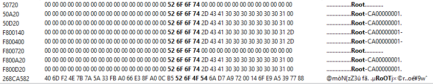
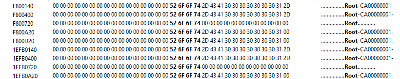

Creating a ISO copy doesn't work.

I debug some informations:
- The FST doesn't work, dolphin not showing the file tree
- By raw copying the FST, the game won't launch, because unauthorized device
- By raw copying partition, it works BUT 4 bytes are different:
- C3 F8 1A 8E at 0x4FFFB

Some difference in ISO:
- 0x40020
- 0x50000 (certificate, so probably the unauthorized device for the UPDATE partition ?)

The first image is the original ISO and the second one the rebuilt so i have something about offsetting.
Btw, the name "ROOT" appears too many times in the rebuilt one.

So, i'm currently trying to copy byte per byte every single structure and used struct to test what's going on.
Currently, i tested to use the struct on:
- Disc header (game_id, game_title, etc.)
- Some partitions data:
  - Header
  - TMD
  - Certificates

The copy ISO works when all of things above are created by structs and byte per byte copy for the rest.

All these datas works:
  - Header
  - bi2
  - apploader
  - DOL

So, it seems to have something to do with the FST and H3 table.
