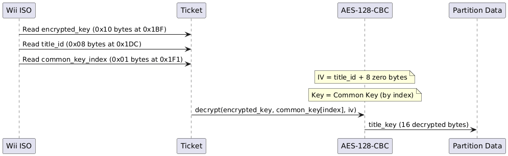
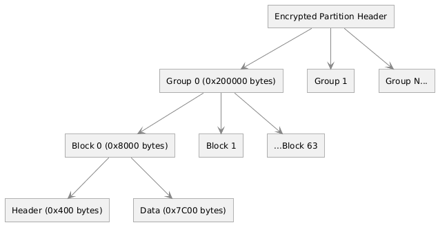
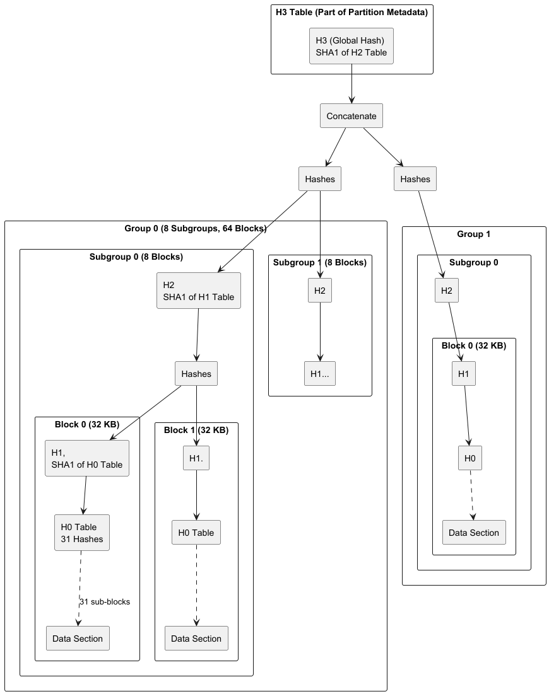
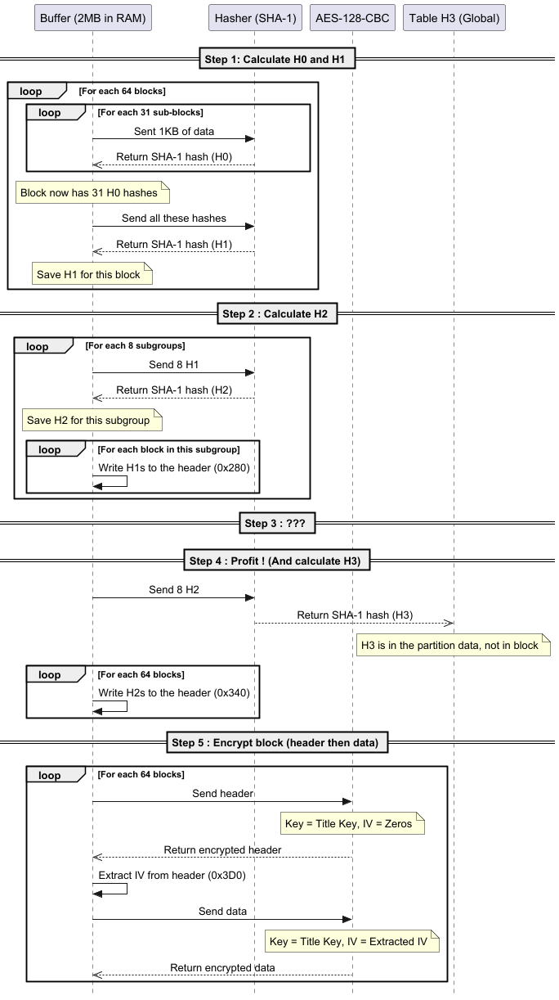

# Wii ISO Structure and Decryption Process

## Overview

A Wii disc is an ISO image of **4.7 GB** (single-layer) or **8.5 GB** (dual-layer) organized in successive layers. There are several levels: **Disc Header**, **Partition Table**, **Partition Headers** (containing the [Ticket](https://wiibrew.org/wiki/Ticket) and [TMD](https://wiibrew.org/wiki/Title_metadata)), then **AES decryption** of the data to finally access the **File System Table** (FST).

---

## Disc Header (`0x000` – `0x440`)

The **Disc Header** sits at the very beginning of the ISO (offset `0x000`). It is read unencrypted and holds the global disc metadata.

| Offset  | Size    | Field                     | Description                                                          |
|---------|---------|---------------------------|----------------------------------------------------------------------|
| `0x000` | `0x06`  | Game ID                   | Unique game identifier (like `RMGE01` for Super Mario Galaxy NTSC-U) |
| `0x006` | `0x01`  | Disc Number               | Disc number (0 for single-disc games)                                |
| `0x007` | `0x01`  | Disc Version              | Disc version                                                         |
| `0x008` | `0x01`  | Audio Streaming           | Audio streaming enable flag                                          |
| `0x009` | `0x01`  | Stream Buffer Size        | Streaming buffer size                                                |
| `0x018` | `0x04`  | Wii Magic Word            | Must be `0x5D1C9EA3` for a valid Wii disc                            |
| `0x01C` | `0x04`  | GameCube Magic Word       | `0xC2339F3D` for GameCube                                            |
| `0x020` | `0x40`  | Game Title                | Game name in ASCII                                                   |
| `0x060` | `0x01`  | Disable Hash Verification | If set, disables H3 hash verification                                |
| `0x061` | `0x01`  | Disable Disc Encryption   | If set, the disc is unencrypted                                      |
| `0x080` | `0x380` | Padding                   | Just `\x00`                                                          |

### Internal Header (inside decrypted data)

Once the DATA partition is decrypted, a **second Disc Header** (internal, called `boot.bin`) is found at offset `0x000` of the decrypted data. It additionally contains:

| Offset  | Size   | Field        | Description                |
|---------|--------|--------------|----------------------------|
| `0x420` | `0x04` | DOL Offset   | Executable file offset     |
| `0x424` | `0x04` | FST Offset   | File System Table offset   |
| `0x428` | `0x04` | FST Size     | FST size                   |
| `0x42C` | `0x04` | FST Max Size | Maximum allocated FST size |

> DOL/FST offsets are stored right-shifted by 2 bits (`>> 2`). To get the actual offset, multiply by 4 (`<< 2`). This is what [`read_u64_shifted()`](../src/helpers/Utils.py).

> References: [WiiBrew – Wii Disc Header](https://wiibrew.org/wiki/Wii_disc#Header) / [Decrypted header](https://wiibrew.org/wiki/Wii_disc#Decrypted)
>
> In code: [DiscHeader.py](../src/structs/DiscHeader.py)
---

## Partition Table (`0x40000`)

> [WiiBrew – Partitions Information](https://wiibrew.org/wiki/Wii_disc#Partitions_information)
>
> [WiiPartitionEntry.py](../src/structs/WiiPartitionEntry.py)

The partition table is always at the fixed offset `0x40000`. It defines 4 partition groups, each consisting of:

| Field  | Size   | Description                            |
|--------|--------|----------------------------------------|
| Count  | `0x04` | Number of partitions in this group     |
| Offset | `0x04` | Offset (shifted) to this group entries |

Each **partition entry** consists of:

| Field            | Size   | Description                             |
|------------------|--------|-----------------------------------------|
| Partition Offset | `0x04` | Partition offset (shifted)              |
| Partition Type   | `0x04` | `0` = DATA, `1` = UPDATE, `2` = CHANNEL |

The **DATA** partition contains the game itself. 
The **UPDATE** partition holds system update. 
The **CHANNEL** partition holds when game have channels like wii fit, Mario Kart.

Super Smash Bros Brawl has a lot of partitions. Each one for the virtual game
The partition types are defined in [Enums.py](../src/helpers/Enums.py) as `WiiPartType`.

---

## Partition Header

Each partition starts with a header containing:

Here is the content of a Partition Header

| Offset  | Size    | Field                   |
|---------|---------|-------------------------|
| `0x000` | `0x2A4` | Ticket                  |
| `0x2A4` | `0x04`  | TMD Size                |
| `0x2A8` | `0x04`  | TMD Offset shifted      |
| `0x2AC` | `0x04`  | Cert Size               |
| `0x2B0` | `0x04`  | Cert Offset shifted     |
| `0x2B0` | `0x04`  | H3 table offset shifted |
| `0x2B4` | `0x04`  | Data Size shifted       |
| `0x2B8` | `0x04`  | Data Offset shifted     |
| `0x2BC` | `0x04`  | FST Max Size            |

> All offsets in the partition header are **relative to the partition start**.

> Reference: [WiiBrew – Partition](https://wiibrew.org/wiki/Wii_disc#Partition)
>
> In code: [WiiPartitionHeader.py](../src/structs/WiiPartitionHeader.py)

---

## Ticket - Title key decryption

Tickets contains the encrypted AES title key and the title ID of the data. Ticket are signed from a certificate chain.

### Title key decryption process

For nintendo common key (16 bytes AES keys):
- Index 0: "Normal" common key, the most frequent
- Index 1: Korean common key

For information, IV stands for **Initialization Vector** _(and not for Individual values from Pokémon)_. 
This is used in cryptography as an initial state (sometimes is random, sometimes need to be non-repeating, etc.)

> Reference: [WiiBrew – Ticket](https://wiibrew.org/wiki/Ticket)
>
> In code: [Ticket.py](../src/structs/Ticket.py)

---

### TMD (Title MetaData)

The Title MetaData is used to store information about a title and its contents and their SHA1 hashes.

Here is the structure

| Offset  | Size    | Field                                                   |
|---------|---------|---------------------------------------------------------|
| `0x000` | `0x04`  | Signature type (always 0x10001 for RSA-2048 with SHA-1) |
| `0x004` | `0x100` | Signature                                               |
| `0x104` | `0x3C`  | Padding for 64 bytes aligment                           |
| `0x140` | `0x3C`  | Certificate issuer                                      |
| `0x180` | `0x01`  | Version                                                 |
| `0x181` | `0x01`  | ca_crl_version                                          |
| `0x182` | `0x01`  | signer_crl_version                                      |
| `0x183` | `0x01`  | Is vWii                                                 |
| `0x184` | `0x08`  | System Version                                          |
| `0x18C` | `0x08`  | Title ID                                                |
| `0x194` | `0x04`  | Title type                                              |
| `0x198` | `0x02`  | Group ID                                                |
| `0x19A` | `0x02`  | ---                                                     |
| `0x19C` | `0x02`  | Region                                                  |
| `0x19E` | `0x10`  | Ratings                                                 |
| `0x1AE` | `0x0C`  | Reserved                                                |
| `0x1BA` | `0x0C`  | IPC Mask                                                |
| `0x1C6` | `0x12`  | Reserved                                                |
| `0x1D8` | `0x04`  | Access rights                                           |
| `0x1DC` | `0x02`  | Title version                                           |
| `0x1DE` | `0x02`  | Number of contents                                      |
| `0x1E0` | `0x02`  | boot index                                              |
| `0x1E2` | `0x02`  | Minor version, unused                                   |

## CMD (Content MetaData)

Each CMD has this structre:

| Offset | Size   | Field      |
|--------|--------|------------|
| `0x00` | `0x04` | Content ID |
| `0x04` | `0x02` | Index      |
| `0x06` | `0x02` | Type       |
| `0x08` | `0x08` | Size       |
| `0x10` | `0x14` | SHA1 hash  |

> Reference: [WiiBrew – Title Metadata](https://wiibrew.org/wiki/Title_metadata)
> 
> In code: 
> - [TMD.py](../src/structs/TMD.py)
> - [TMDContent.py (CMD)](../src/structs/TMDContent.py)

---

## Certificate chain
Most chains contains 3 certificated, each padded to 0x40.

Each certificate contains this structure:

| Offset      | Length | Description                |
|-------------|--------|----------------------------|
| `0x000`     | `0x04` | Signature type             |
| `0x004`     | `X`    | Signature                  |
| `0x040` + X | `0x40` | Issuer                     |
| `0x080` + X | `0x04` | Key type                   |
| `0x084` + X | `0x40` | Child Certificate Identity |
| `0x0c4` + X | `0x04` | Key ID                     |
| `0x0c8` + X | `Y`    | Public Key                 |

Since the signature depends on the signature type (see below), the offset depends on the signature type

### Signatures types
| Name           | Signature Type | Signature Length |
|----------------|----------------|------------------|
| Elliptic Curve | `0x00010002`   | `0x03c`          |
| RSA-2048       | `0x00010001`   | `0x100`          |
| RSA-4096       | `0x00010000`   | `0x200`          |

### Key types
| Name           | Signature Type | Key length | Key Modulus | Key Public exponent | Key padding to `0x40` |
|----------------|----------------|------------|-------------|---------------------|-----------------------|
| Elliptic Curve | `0x00000002`   | `0x238`    | `0x200`     | `0x04`              | `0x34`                |
| RSA-2048       | `0x00000001`   | `0x138`    | `0x100`     | `0x04`              | `0x34`                |
| RSA-4096       | `0x00000000`   | `0x78`     | `0x3C`      | `0x00`              | `0x3C`                |

---

## Data decryption/encryption
Partition data is encrypted with AES-128-CBC using the title key. The layout is:

### Block structure
| Offset  | Length   | Description                 |
|---------|----------|-----------------------------|
| `0x000` | `0x0400` | Block header (H0, H1, etc.) |
| `0x3D0` | `0x0010` | Data IV                     |
| `0x400` | `0x7C00` | Encrypted Data              |

### Block decryption process
- Read the `0x8000` bytes block from the ISO
- Extract the IV at offset `0x3D0` of the block header
- Decrypt data at offset `0x400` with AES-128-CBC using the title key and IV
- Result is `0x7C00` bytes of decrypted data

> Reference: [WiiBrew - Wii Disc - Encrytped](https://wiibrew.org/wiki/Wii_disc#Encrypted)
> 
> Code: [CryptPartReader.py](../src/crypto/CryptPartReader.py)

### Encryption and hashing processes
This part is quite difficult.
Data within block, group are hashed then encrypted. So, if we need to change files, we also need to hash then encrypt all datas.
Before, in the header we said that it contains H0, H1, etc. It's from a [Merkle Tree](https://en.wikipedia.org/wiki/Merkle_tree), a tree with every node that is not a leaf is a hash of its child.
For Wii ISO, it's like this:

Since the algorithm is pretty hard to understand, here a good sequence diagram:

> Reference: [WiiBrew - Wii Disc - Encrytped](https://wiibrew.org/wiki/Wii_disc#Encrypted)
> 
> Code: 
> - [CryptPartWriter.py](../src/crypto/CryptPartWriter.py)
> - [Utils - encrypt_group function ](../src/helpers/Utils.py)
---
## References

- [WiiBrew – Wii Disc](https://wiibrew.org/wiki/Wii_disc)
- [WiiBrew – Ticket](https://wiibrew.org/wiki/Ticket)
- [WiiBrew – Title Metadata](https://wiibrew.org/wiki/Title_metadata)
- [WiiBrew – Certificate Chain](https://wiibrew.org/wiki/Certificate_chain)
- [WiiBrew – DOL](https://wiibrew.org/wiki/DOL)
