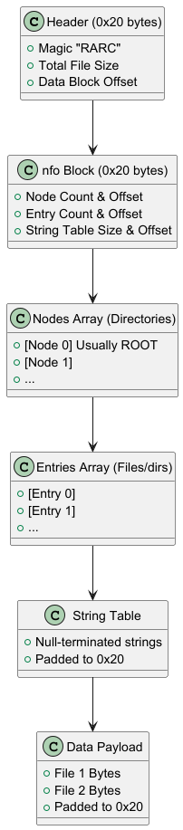
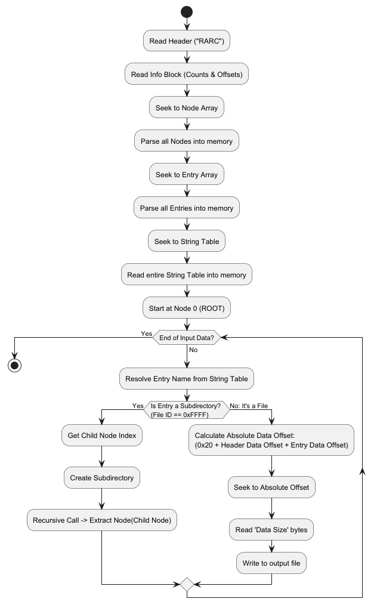
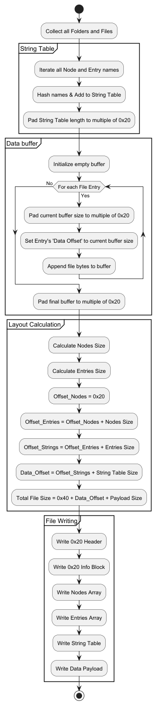

# RARC Format
RARC (Revolution Archive) is a proprietary archive file format primarily used in Nintendo GameCube and Wii games. 
It acts like a mini file system or a .zip file without compression, storing a hierarchy of directories (Nodes) and files (Entries) along with their actual binary data

## Structure
A RARC file is divided into several contiguous sections. Offsets for the internal structures (Nodes, Entries, String Table) are usually relative to the Info Block (which starts at 0x20), while the file data offsets are relative to the Data Block starting address

## Detailed section

### Header & info block

The file starts with a `0x20` byte header, immediately followed by a `0x20` byte info block
- **Header:** Defines the file as a RARC and tells where the data are (and its length)
- **Info block:** Provides the counts and offsets for the arrays (Nodes and Entries) and the string table

### Nodes - 0x10 bytes
A node represents a folder with this structure:
- **Type:** A 4-char string (padded with spaces if less)
- **Name Offset:** Pointer to the directory's name in the String Table
- **Name Hash:** A hash of the name
- **Entry Count:** How many nodes are inside this node
- **First Entry Index:** Offset of the first node 

### File - 0x14 bytes
A file represents a file or a directory:
- **File ID:** An ID for the file. `0xFFFF` if it's a directory
- **Hash**
- Attributes (Type & Name Offset):
  - 8 bits as flags: The entry Type (0x02 for directory, 0x01 for file)
  - Lower 16 bits: The offset to the file name in the String Table
- Data Offset or Index: 
  - If it's a File: This is the offset to the file data (relative to the data block)
  - If it's a Subdirectory: This is the index of the child Node
- Data Size: The size of the file in bytes

## Reading

## Writing

## References

- [Pikmin Technical Knowledge Base](https://pikmintkb.com/wiki/RARC_file)
- [Custom Mario kart Wiiki](https://wiki.tockdom.com/wiki/RARC_(File_Format))
- [Luma's Workshop](https://www.lumasworkshop.com/wiki/RARC_(File_Format))
- [Amnoid.de](http://www.amnoid.de/gc/Rarc.txt)