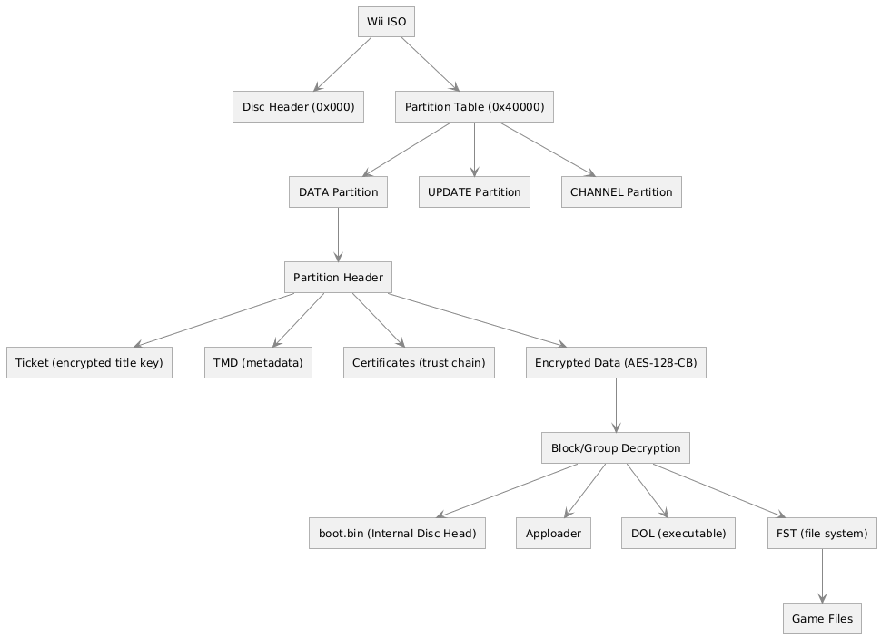
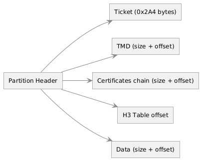

# Wii ISO Structure and Decryption Process

## Overview

A Wii disc is an ISO image of **4.7 GB** (single-layer) or **8.5 GB** (dual-layer) organized in successive layers. There are several levels: **Disc Header**, **Partition Table**, **Partition Headers** (containing the [Ticket](https://wiibrew.org/wiki/Ticket) and [TMD](https://wiibrew.org/wiki/Title_metadata)), then **AES decryption** of the data to finally access the **File System Table** (FST).

---

## Disc Header (`0x000` – `0x440`)

The **Disc Header** sits at the very beginning of the ISO (offset `0x000`). It is read unencrypted and holds the global disc metadata.

| Offset  | Size    | Field                     | Description                                                          |
|---------|---------|---------------------------|----------------------------------------------------------------------|
| `0x000` | `0x06`  | Game ID                   | Unique game identifier (like `RMGE01` for Super Mario Galaxy NTSC-U) |
| `0x006` | `0x01`  | Disc Number               | Disc number (0 for single-disc games)                                |
| `0x007` | `0x01`  | Disc Version              | Disc version                                                         |
| `0x008` | `0x01`  | Audio Streaming           | Audio streaming enable flag                                          |
| `0x009` | `0x01`  | Stream Buffer Size        | Streaming buffer size                                                |
| `0x018` | `0x04`  | Wii Magic Word            | Must be `0x5D1C9EA3` for a valid Wii disc                            |
| `0x01C` | `0x04`  | GameCube Magic Word       | `0xC2339F3D` for GameCube                                            |
| `0x020` | `0x40`  | Game Title                | Game name in ASCII                                                   |
| `0x060` | `0x01`  | Disable Hash Verification | If set, disables H3 hash verification                                |
| `0x061` | `0x01`  | Disable Disc Encryption   | If set, the disc is unencrypted                                      |
| `0x080` | `0x380` | Padding                   | Just `\x00`                                                          |

### Internal Header (inside decrypted data)

Once the DATA partition is decrypted, a **second Disc Header** (internal, called `boot.bin`) is found at offset `0x000` of the decrypted data. It additionally contains:

| Offset  | Size   | Field        | Description                |
|---------|--------|--------------|----------------------------|
| `0x420` | `0x04` | DOL Offset   | Executable file offset     |
| `0x424` | `0x04` | FST Offset   | File System Table offset   |
| `0x428` | `0x04` | FST Size     | FST size                   |
| `0x42C` | `0x04` | FST Max Size | Maximum allocated FST size |

> DOL/FST offsets are stored right-shifted by 2 bits (`>> 2`). To get the actual offset, multiply by 4 (`<< 2`). This is what [`read_u64_shifted()`](../src/helpers/Utils.py).

> References: [WiiBrew – Wii Disc Header](https://wiibrew.org/wiki/Wii_disc#Header) / [Decrypted header](https://wiibrew.org/wiki/Wii_disc#Decrypted)
>
> In code: [DiscHeader.py](../src/structs/DiscHeader.py)
---

## Partition Table (`0x40000`)

> [WiiBrew – Partitions Information](https://wiibrew.org/wiki/Wii_disc#Partitions_information)
>
> [WiiPartitionEntry.py](../src/structs/WiiPartitionEntry.py)

The partition table is always at the fixed offset `0x40000`. It defines 4 partition groups, each consisting of:

| Field  | Size   | Description                            |
|--------|--------|----------------------------------------|
| Count  | `0x04` | Number of partitions in this group     |
| Offset | `0x04` | Offset (shifted) to this group entries |

Each **partition entry** consists of:

| Field            | Size   | Description                             |
|------------------|--------|-----------------------------------------|
| Partition Offset | `0x04` | Partition offset (shifted)              |
| Partition Type   | `0x04` | `0` = DATA, `1` = UPDATE, `2` = CHANNEL |

The **DATA** partition contains the game itself. 
The **UPDATE** partition holds system update. 
The **CHANNEL** partition holds when game have channels like wii fit, Mario Kart.

Super Smash Bros Brawl has a lot of partitions. Each one for the virtual game
The partition types are defined in [Enums.py](../src/helpers/Enums.py) as `WiiPartType`.

---

## Partition Header

Each partition starts with a header containing:

| Offset  | Size    | Field                   |
|---------|---------|-------------------------|
| `0x000` | `0x2A4` | Ticket                  |
| `0x2A4` | `0x04`  | TMD Size                |
| `0x2A8` | `0x04`  | TMD Offset shifted      |
| `0x2AC` | `0x04`  | Cert Size               |
| `0x2B0` | `0x04`  | Cert Offset shifted     |
| `0x2B0` | `0x04`  | H3 table offset shifted |
| `0x2B4` | `0x04`  | Data Size shifted       |
| `0x2B8` | `0x04`  | Data Offset shifted     |
| `0x2BC` | `0x04`  | FST Max Size            |

> All offsets in the partition header are **relative to the partition start**.

> Reference: [WiiBrew – Partition](https://wiibrew.org/wiki/Wii_disc#Partition)
>
> In code: [WiiPartitionHeader.py](../src/structs/WiiPartitionHeader.py)

---

## References

- [WiiBrew – Wii Disc](https://wiibrew.org/wiki/Wii_disc)
- [WiiBrew – Ticket](https://wiibrew.org/wiki/Ticket)
- [WiiBrew – Title Metadata](https://wiibrew.org/wiki/Title_metadata)
- [WiiBrew – Certificate Chain](https://wiibrew.org/wiki/Certificate_chain)
- [WiiBrew – DOL](https://wiibrew.org/wiki/DOL)
