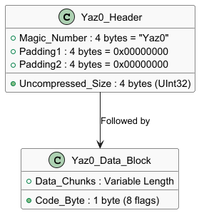
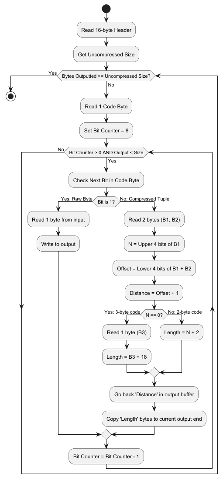
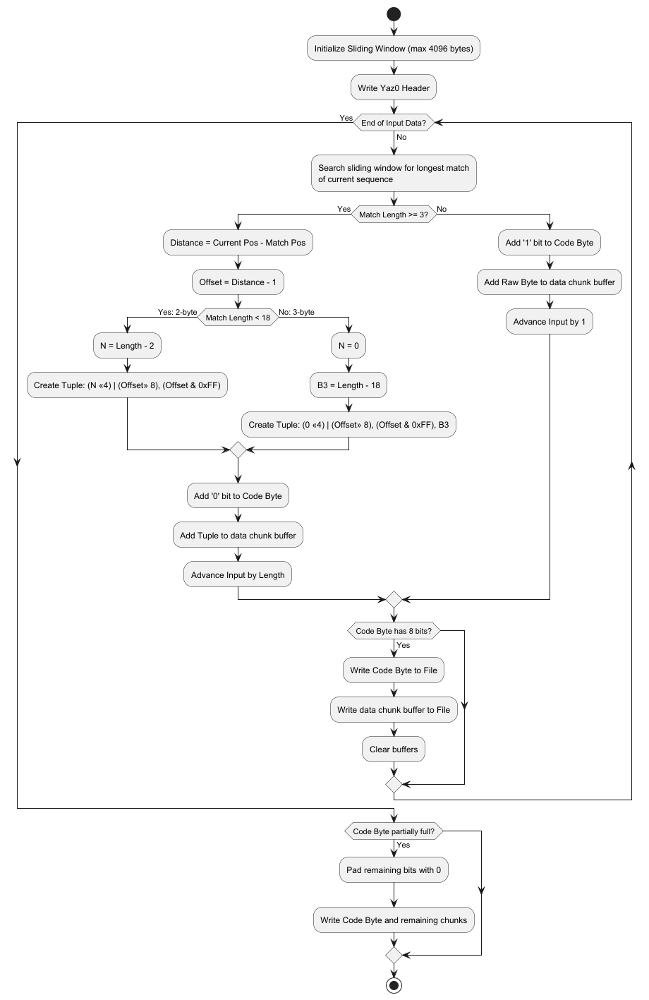

# Yaz0 Format
Yaz0 is a compression algorithm developed by Nintendo. 
It is a variant of the LZ77 compression algorithm, which reduces file size by replacing repeated sequences of data with references (pointers) to sequences that have already occurred earlier in the file.

## File Structure
A Yaz0 file consists of a 16-byte header followed by the compressed data blocks.

## How Data block works ?
The compressed data is divided into blocks. Every block starts with a Code Byte.
- This byte contains 8 bits.
- We read these bits from left to right (MSB to LSB).
- Each bit tells the decoder how to read the next chunk of data.
  - If the bit is 1: The next chunk is a single uncompressed byte. Copy it directly to the output.
  - If the bit is 0: The next chunk is a 2-byte or 3-byte pointer that tells the decoder to go back in the output and copy a sequence of bytes.

## Decompression
When the bit is `0`, you read a 2-byte pointer: `Byte1` and `Byte2`.
Let `N` be the first 4 bits of `Byte1`:
- **The Offset:** Combine the lower 4 bits of `Byte1` with the 8 bits of `Byte2` to get a 12-bit number. 
Add 1 to this number. This is how many bytes you go backwards in your output buffer to start copying

- **The Length**:
  - If `N` > 0 (2-Byte Encoding): The length is `N + 2`.
  - If `N` == 0 (3-Byte Encoding): Read a 3rd byte (`Byte3`). The length is `Byte3` + 0x12.

### Flowchart

## Compression
Compressing data into Yaz0 is more complext since it requires a sliding windows to search for the longest matching sequence of bytes.
- Look at the current position in the uncompressed file
- Search the last 4096 bytes to find if the current sequence of bytes has appeared before
- f a match is found and is at least `3 bytes` long, calculate the distance (offset) and the length, and encode it as a 0 bit followed by a 2-byte or 3-byte pointer
- Otherwise, leave the byte uncompressed, encode it as a 1 bit, and write the raw byte.
- Group bits into blocks of 8 to create the Code Byte

### Flowchart

## References:
- [Custom Mario Kart Wiiki](https://wiki.tockdom.com/wiki/YAZ0_(File_Format))
- [Amnoid.de](http://www.amnoid.de/gc/yaz0.txt)

The code in `yaz0.py` uses more a lazy approach than a greedy one. It might be good to have a dynamic programming but might be slow i guess.